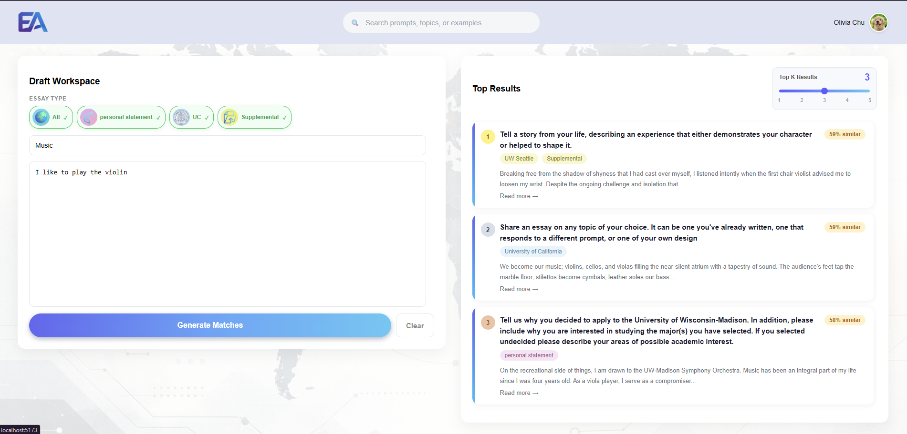
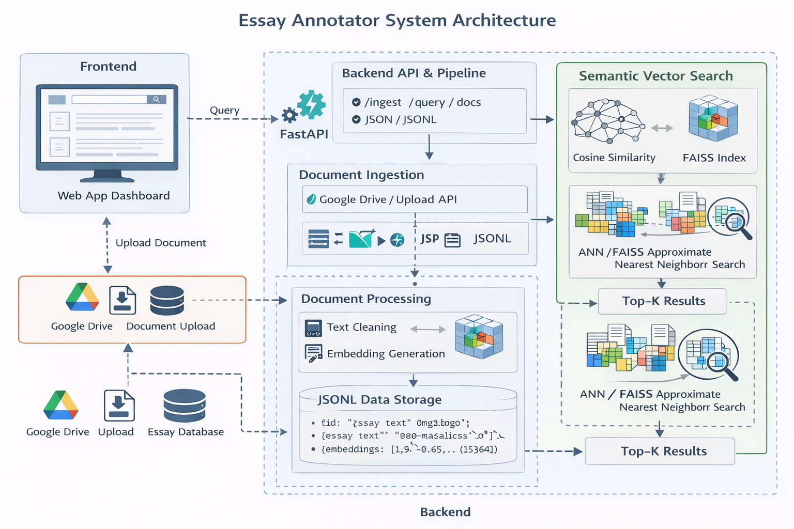

# Essay-Annotator 

<p align="center">
  
  
</p>

**Essay-Annotator** is a data-driven platform designed to help students learn how to write effective U.S. college application essays by analyzing real examples and providing structural, non-ghostwriting feedback.


---
## 📖 Table of Contents
- [Introduction](#introduction)
- [Motivation](#motivation)
- [Architecture](#architecture)
- [Getting Started](#getting-started)
- [Tech Stack](#tech-stack)
- [Contributors](#contributors)

## Introduction
Essay-Annotator implements an **end-to-end NLP pipeline** for long-form student essays, covering:

- Heterogeneous data ingestion
- Document normalization
- Dense vector embedding
- Semantic similarity retrieval

As a research prototype, this system facilitates the study of **semantic similarity**, **narrative structure alignment**, and **thematic clustering** in long-form reflective student writing.

This project serves as a **research prototype** for studying:

- Semantic similarity in long-form writing  
- Narrative structure alignment  
- Thematic clustering in personal essays  

---

## Motivation

College application essays present unique challenges for traditional retrieval systems:

- Long-form, highly personal narratives  
- Themes are implicit rather than keyword-based  
- Emotional arcs and storytelling structure matter  
- Prompt alignment is semantically subtle 

❌ Traditional methods (e.g., BM25) struggle  
✅ Dense embeddings enable deeper semantic understanding 

**Goal:** 
Explore whether vector-based retrieval can better capture **meaning, structure, and storytelling quality**.

---

## Architecture
<p align="center">
  
  
</p>

**Implementation Details**

1.**Data Ingestion Pipeline**
    
  **Goal:** Convert heterogeneous document into a structured schema.
  - raw_data (Hand Collection from past students applying to US colleges) 
  - Public Essays Examples (Essays-That-Worked)

**Output Schema (JSONL)**
```bash
{
  "id": "essay_0001",
  "topic": "...",
  "content": "...",
  "type": "personal_statement",
  "school": "Stanford",
  "public": "yes",
  "source_file": "..."
}
```

2.**Embedding Generation**

We convert textual fields into dense vector representations using OpenAI’s embedding model.

- Model: text-embedding-3-large (or configured alternative)
- Batch processing is used to improve efficiency.
- Both topic and content fields are embedded.
- Embeddings are L2-normalized before storage.

**Each enriched record is saved into:**
```bash
data/embed_output/embed.jsonl
```

Example stored structure:
```bash
{
  "id": "essay_0001",
  "topic": "...",
  "content": "...",
  "embedding": [0.0123, -0.9382, ...]
}
```

3.**Vector Search (Cosine Similarity)**

For semantic retrieval:

- The user query is embedded using the same model.
- Cosine similarity is computed against all stored embeddings.
- Top-K highest scoring essays are returned.

**Similarity formula:**

$$\text{cosine}(q, d) = \frac{q \cdot d}{\|q\| \cdot\ d\|} $$

**But because all vectors are L2-normalized:**

$$\text{cosine}(q, d) = q \cdot d $$

---


### Getting Started
Prerequisites
- Python 3.10+
- Node.js (for frontend)

Backend Setup
```bash
cd BackEnd
python -m venv .venv
source .venv/bin/activate   # Mac/Linux
# or
.venv\Scripts\activate      # Windows

pip install -r requirements.txt

uvicorn app.main:app --reload
```

Fronted Setup
```bash
cd frontend
npm install
npm run dev
```
--- 


### Tech Stack
**Backend**
- FastAPI
- NumPy
- OpenAI API (Embeddings)
- JSONL-based storage

**Frontend**
- React
- TypeScript

**Infrastructure**
- AWS EC2 (deployment)

**Dataset**
- 200+ real accepted essays
- Multiple schools
- Personal statements, UC essays, and supplments

## Contributors:
**Backend**
1. Zackery Liu (University of Wisconsin-Madison)
2. Amanda Tsai (University of California San Diego)

**Frontend**
1. Olivia Chu (University of Wisconsin-Madison)