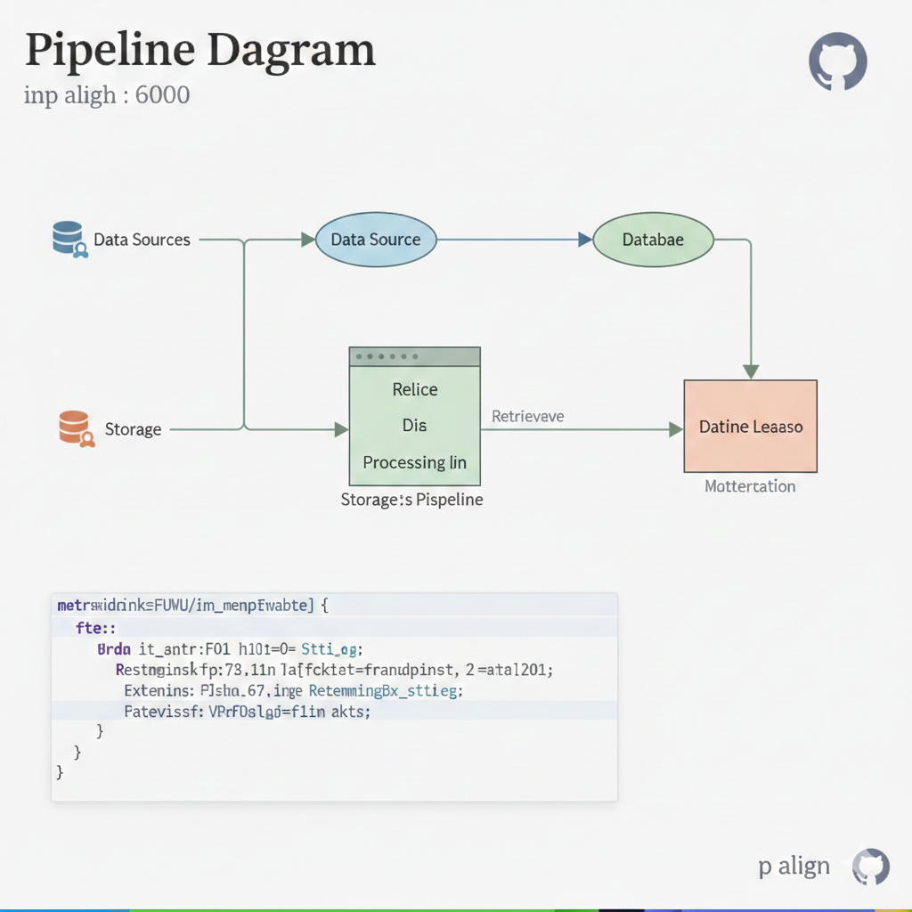

# Essay-Annotator 
> **A Modular Dense Retrieval Framework for College Essay Semantic Search**

<p align="center">
  
</p>

EssayLens is a data-driven platform designed to help students learn how to write effective U.S. college application essays by analyzing real examples and providing structural, non-ghostwriting feedback.


---
## 📖 Table of Contents
- [Abstract](#abstract)
- [Motivation](#motivation)
- [Architecture](#architecture)
- [Contributors](#contributors)

## Abstract
**Essay-Annotator** implements an end-to-end pipeline covering heterogeneous data ingestion, document normalization, dense vector generation, and optimized similarity search. 

As a research prototype, this system facilitates the study of **semantic similarity**, **narrative structure alignment**, and **thematic clustering** in long-form reflective student writing.

The system constructs an end-to-end pipeline that:

1. Ingests essays from multiple sources (Google Drive and public web crawlers),

2. Normalizes documents into a unified structured schema,

3. Generates dense vector representations using pretrained embedding models,

4. Performs cosine-based top-K retrieval over the vector database.

This repository serves as a research prototype for studying semantic similarity, narrative structure alignment, and thematic clustering in long-form student writing.


---


## Motivation

College application essays present unique challenges for retrieval systems:
- They are long-form, reflective narratives.
- Themes are often implicit rather than keyword-driven.
- Emotional progression and growth arcs matter.
- Prompt alignment is semantically nuanced.
- Traditional keyword-based retrieval (e.g., BM25) struggles to capture narrative similarity and thematic resonance.

This project explores whether dense vector representations can provide a more semantically meaningful retrieval mechanism for long-form essays.


1.  **Data Sources**: Heterogeneous collection from Google Drive and public web crawlers.
2.  **Ingestion & Normalization**: Standardizing raw text into a unified JSONL schema with deterministic state tracking.
3.  **Embedding**: Generating 1536-dimensional vectors using `text-embedding-3-small`.
4.  **Vector Store**: Memory-efficient streaming storage for high-dimensional vectors.
5.  **Retrieval Engine**: Optimized matrix-based similarity computation.

---


## Architecture
<p align="center">
  
  
</p>

**Implementation Details**

1.**Data Ingestion Pipeline**
    
  **Goal:** Convert heterogeneous document into a structured schema.
  - raw_data (Hand Collection from past students applying to US colleges) 
  - Public Essays Examples (Essays-That-Worked)

**Output Schema (JSONL)**
```bash
{
  "id": "essay_0001",
  "topic": "...",
  "content": "...",
  "type": "personal_statement",
  "school": "Stanford",
  "public": "yes",
  "source_file": "..."
}
```

2.**Embedding Generation**

We convert textual fields into dense vector representations using OpenAI’s embedding model.

- Model: text-embedding-3-large (or configured alternative)
- Batch processing is used to improve efficiency.
- Both topic and content fields are embedded.
- Embeddings are L2-normalized before storage.

**Each enriched record is saved into:**
```bash
data/embed_output/embed.jsonl
```

Example stored structure:
```bash
{
  "id": "essay_0001",
  "topic": "...",
  "content": "...",
  "embedding": [0.0123, -0.9382, ...]
}
```

3.**Vector Search (Cosine Similarity)**

For semantic retrieval:

- The user query is embedded using the same model.
- Cosine similarity is computed against all stored embeddings.
- Top-K highest scoring essays are returned.

**Similarity formula:**

$$\text{cosine}(q, d) = \frac{q \cdot d}{\|q\| \cdot\ d\|} $$

**But because all vectors are L2-normalized:**

$$\text{cosine}(q, d) = q \cdot d $$

---


### Prerequisites
- Python 3.10+
- OpenAI API Key
- Google Cloud Service Account (for private Drive access)

--- 


### Instructions
```bash

# 2. Generate dense embeddings
python embedding/make_embedding.py

# 3. Execute semantic search
python embedding/search_similar.py --query "overcoming personal challenges in STEM"
Technical Implementation1. Corpus NormalizationDocuments are normalized into a unified schema to ensure metadata traceability and consistent retrieval:JSON{
  "id": "essay_0001",
  "topic": "Personal Statement",
  "content": "Narrative text...",
  "school": "UW-Madison",
  "source_file": "..."
}
```

## Contributors:
1. Zackery Liu (UW-Madison)
2. Amanda Tsai (UCSD)
3. Olivia Chu (UW-Madison)